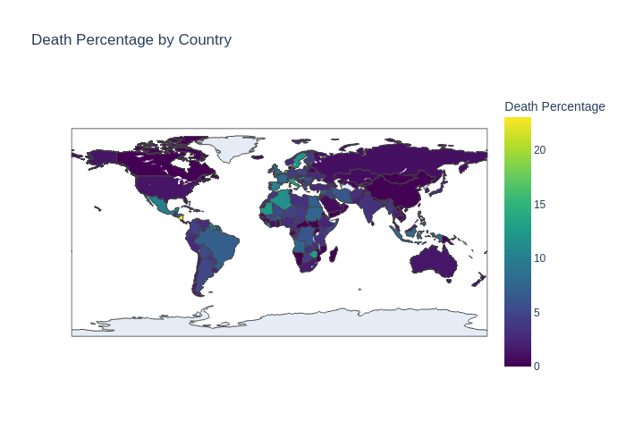

# COVID-19 Data Analysis

This project provides a comprehensive analysis of COVID-19 data, offering valuable insights into the pandemic's impact on a global scale. Leveraging Python libraries such as Pandas, NumPy, Matplotlib, Seaborn, and Plotly, this analysis delves into key aspects of the virus's spread and effects.  Created using Google collab, based on a 29th February 2020 COVID-19 dataset from Kaggle

## Key Features

- **Data Cleaning and Preparation:**  Handles missing values and prepares the dataset for analysis.
- **Exploratory Data Analysis:**  Provides in-depth exploration of confirmed cases, deaths, and recoveries by region.
- **Data Visualization:**  Utilizes visualizations like heatmaps and choropleth maps to present data in an easily understandable manner.
- **Statistical Analysis:**  Calculates and analyzes key metrics, such as death percentages and maximum/minimum values.
- **Country-Specific Analysis:**  Allows for focused analysis on specific countries, such as India in the provided example.
- **Interactive Visualizations:**  Employs Plotly to create interactive visualizations that enhance user engagement.

## Choropleth Map Visualization

A choropleth map is used to visualize the global distribution of death percentages. This interactive map allows users to explore the data by hovering over individual countries to view specific details. The color scale represents the death percentage, providing a clear visual representation of the impact of the pandemic across different regions.
 - 

## How to Use

1. **Installation:** Ensure you have the necessary libraries installed. You can install them using pip:

 ```
pip install pandas numpy matplotlib seaborn plotly pycountry
```
2. **Data Source:** The project uses a COVID-19 dataset from a GitHub repository. You can replace this with your own dataset if needed.

3. **Run the Notebook:** Execute the provided Jupyter Notebook to perform the analysis and generate visualizations.

## Insights

- Identify regions with the highest and lowest numbers of confirmed cases, deaths, and recoveries.
- Visualize the global distribution of death percentages using a choropleth map.
- Analyze trends and patterns in COVID-19 data for specific countries.
- Gain a deeper understanding of the pandemic's impact on different regions.

## Future Enhancements

- Incorporate time-series analysis to track the evolution of the pandemic.
- Add predictive modeling to forecast future trends.
- Integrate additional data sources for a more comprehensive analysis.

## Contributing

Contributions are welcome! If you have any suggestions, bug fixes, or new features to add, feel free to create a pull request.

## License

This project is licensed under the MIT License.
